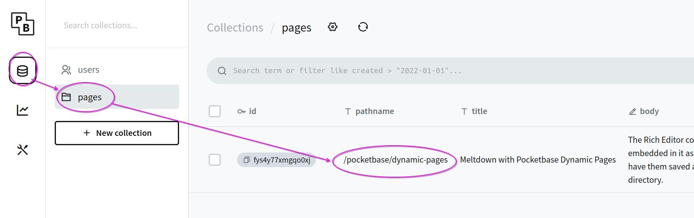

# Deploy Meltdown with Pocketbase Headless CMS

[Meltdown](https://meltdown.dex.yachts) + [Pocketbase](https://pocketbase.io)

```sh
git clone https://github.com/the-syndrome/meltdown-with-pocketbase.git
cd meltdown-with-pocketbase
git clone https://github.com/the-syndrome/meltdown.git app
cp -r pages/* app/src/pages
cp .env.example .env
docker-compose up
```

By default these services will be up with some sample data.

+ pocketbase <http://127.0.0.1:33764/_/> admin user in `.env` file
+ meltdown <http://127.0.0.1:33765>

## Next steps

### Edit pages

A sample page is added by default accessible through Collections ➡️ pages.



### Configure Meltdown

If you're finding it useful you can begin to change the values in the `.env` file documented at <https://meltdown.dex.yachts/deploy/environment>. It's recommended to change the admin information before moving to production. [SSG](https://meltdown.dex.yachts/features/ssg) is particularly useful when deploying.

### Pocketbase JS SDK

They've published a [JS SDK](https://github.com/pocketbase/js-sdk) if you want to tap into more of the power in Pocketbase.

## Pocketbase migrations

We added a few sample migrations in `./pocketbase/pb_migrations`. It's great for testing and teams if you design your [migrations](https://pocketbase.io/docs/js-migrations). Each team member can instantly boot up the project.

## Troubleshooting

### Reach out for help

Join the [Community](https://meltdown.dex.yachts/community)